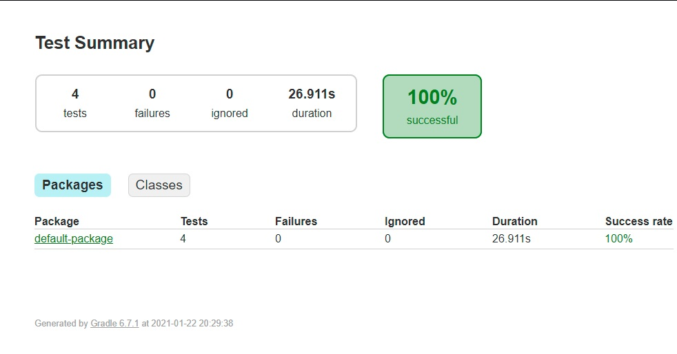
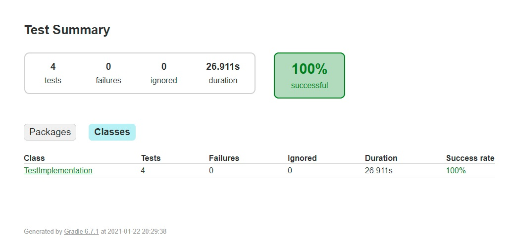
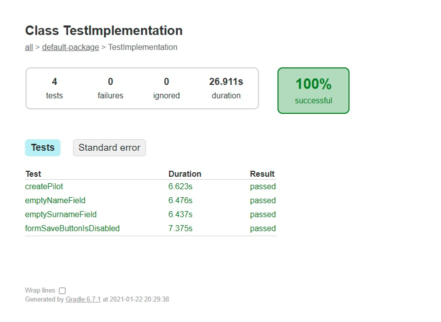

##SPACE APP PILOT CREATOR FORM SELENIUM TESTS
1. Navigate to folder frontend
2. Run `npm install` to fetch dependencies for angular application.
3. For further steps read _frontend/angular-in-space/README.md_
4. Navigate to _space-app-selenium_ folder
5. Run in command line `gradle test`
6. Chek the test results in _build/reports/tests/test/index.html_ (you will need to run html in your browser)

##########################################################

##########################################################

##########################################################

